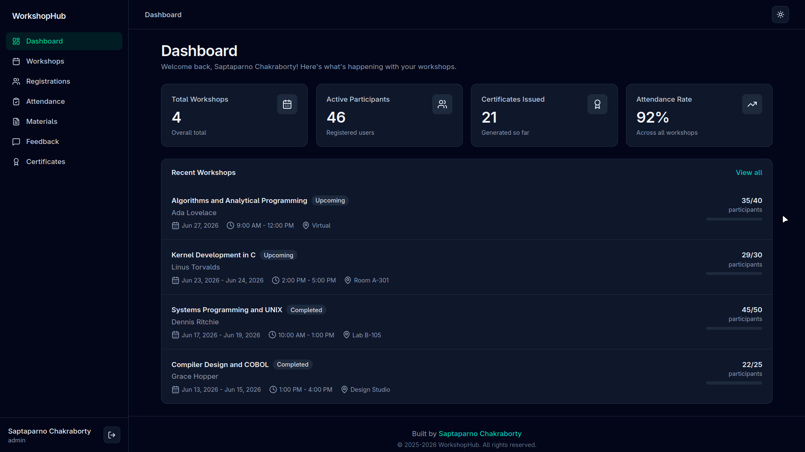
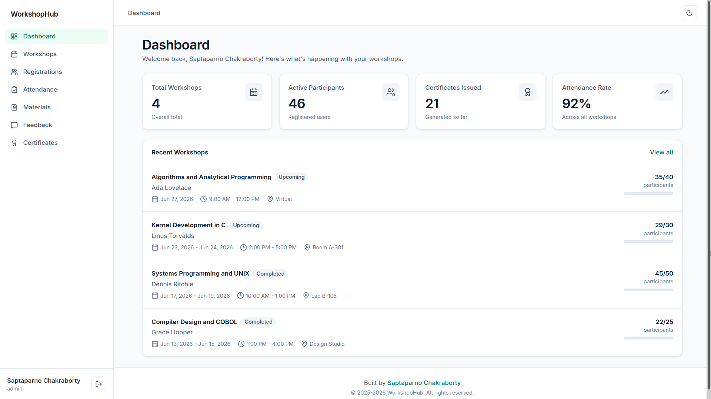
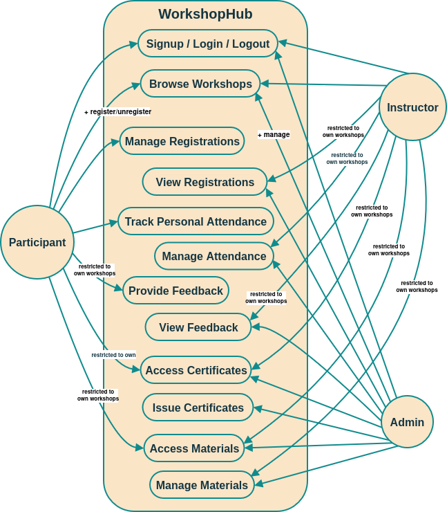

# WorkshopHub

<!-- markdownlint-disable MD033 -->

  
  
  
  
  
  
  
  
  
  

<!-- markdownlint-enable MD033 -->

This project is a full-stack EdTech web application built with Node.js, Express.js, MongoDB, and React.js. It is designed to manage educational workshops.  
The system handles workshop creation, registrations, attendance tracking, feedback collection, material distribution, and certificate generation while strictly enforcing role-based access control (RBAC).  
It aims to streamline the entire workshop lifecycle for admins, instructors, and participants.

> [!IMPORTANT]  
> **Project Status: Complete**  
> WorkshopHub is a completed personal learning and portfolio project developed independently by [me](#author).  
> While the core features have been fully implemented, the project might still receive occasional refinements and bug fixes in the future by [me](#author). Feedback and discussions are always welcome, but the repository is not intended for external contributions.

<b>Toggle light-theme admin dashboard preview</b>

> [!NOTE]  
> These screenshots display placeholder data (names of legendary programmers as instructors and workshop names related to their projects/expertise) used to demonstrate the application's capabilities.

---

## Tech Stack

- **Backend:** Node.js, Express.js  
- **Database:** MongoDB
- **ODM:** Mongoose  
- **Authentication:** JWT-based authentication  
- **Password Hashing:** Bcrypt (for secure password storage)  
- **Testing/Debugging Tools:** Postman, Browser DevTools 
- **Frontend:** React, Tailwind CSS, Vite
- **Certificate PDF Generation:** `pdfkit`
- **Toast Notifications:** `react-hot-toast`
- **Icons:** `lucide-react`

---

## Key Features

- Role-Based Access Control (RBAC) and JWT authentication
- Workshop creation and management
- Seamless participant registration and cancellation
- Attendance tracking with instructor-level restrictions
- Workshop material distribution
- Feedback and rating system
- PDF certificate generation for participants
- Clean and responsive user interface
- Robust RESTful API architecture

---

## System Design

### System Architecture

### UML Use Case Diagram

### Entity Relationship (ER) Diagram

---

## Author

&copy; 2025-2026 [Saptaparno Chakraborty](https://github.com/schak04).  
All rights reserved.

---
